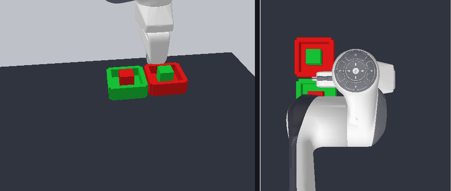
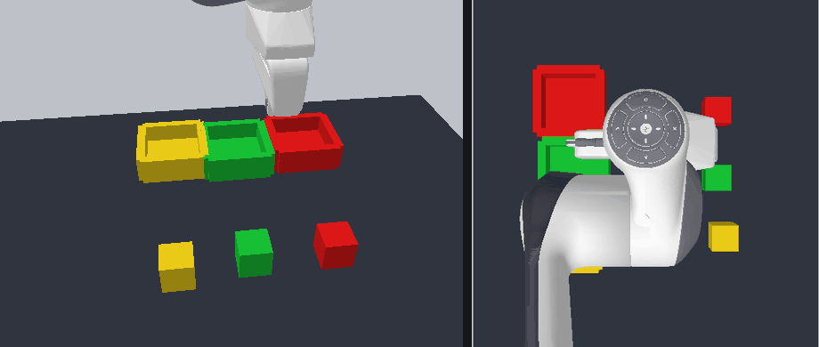
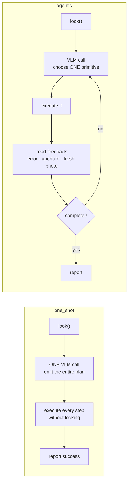
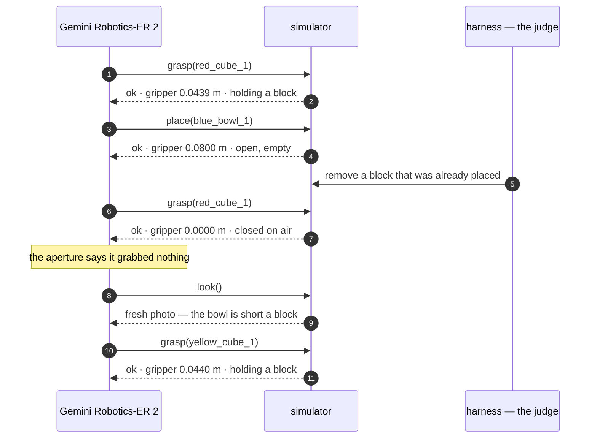

<h1 align="center">Agentic Robot Arm</h1>

<p align="center">
  A Franka Panda driven by <b>Gemini Robotics-ER 2</b>.<br>
  Two conditions. One difference: whether the robot reads its own feedback.
</p>

<p align="center">
  
  
  
  
</p>

<br>

## Three tasks

| | task | what it demands |
|---|---|---|
| **RECOVER** | put 3 blocks in the bowl — one gets removed mid-task | notice the world changed after the plan was made |
| **SWAP** | two blocks start in each other's bowls | park one on the table before its bowl is free |
| **SORT** | three blocks, three bowls | one colour-matched routing decision per object |

These three names are used everywhere — in the charts, the tables, and the scene files
(`disturb_h3`, `mem_swap`, `match3`).

<br>

---

<br>

### RECOVER

A block that was already placed is taken back out, mid-task.

<table>
<tr><th width="50%">one-shot</th><th width="50%">agentic</th></tr>
<tr>
<td></td>
<td></td>
</tr>
<tr>
<td align="center"><b>claims success</b> · 2 of 3 placed</td>
<td align="center"><b>notices · recovers</b> · 3 of 3</td>
</tr>
</table>

<br>

### SWAP

Red starts in the green bowl, green starts in the red bowl. Neither can go home first.

<table>
<tr><th width="50%">one-shot</th><th width="50%">agentic</th></tr>
<tr>
<td></td>
<td></td>
</tr>
<tr>
<td align="center"><b>claims success</b> · 0 of 2 placed</td>
<td align="center"><b>parks one, then completes</b> · 2 of 2</td>
</tr>
</table>

<br>

### SORT

Three blocks, three colour-matched bowls.

<table>
<tr><th width="50%">one-shot</th><th width="50%">agentic</th></tr>
<tr>
<td></td>
<td></td>
</tr>
<tr>
<td align="center"><b>claims success</b> · 2 of 3 placed</td>
<td align="center"><b>completes</b> · 3 of 3</td>
</tr>
</table>

<p align="center"><i>In every clip — left panel: the scene. Right panel: the overhead frame the model sees.</i></p>

<br>

---

<br>

## Results

<br>

<picture>
  <source media="(prefers-color-scheme: dark)" srcset="docs/charts/success_dark.png">
  
</picture>

<br>

| | one-shot | agentic |
|---|:---:|:---:|
| **RECOVER** | 0% | **100%** |
| **SWAP** | 20% | **100%** |
| **SORT** | 60% | **80%** |

<br>

**False successes** — claimed done, oracle disagreed:  one-shot **11**, agentic **1**.

<br>

<picture>
  <source media="(prefers-color-scheme: dark)" srcset="docs/charts/false_dark.png">
  
</picture>

<br>

<picture>
  <source media="(prefers-color-scheme: dark)" srcset="docs/charts/horizon_dark.png">
  
</picture>

<br>

---

<br>

## What the results say

<br>

<table>
<tr><td width="50%" align="center">

### one-shot
# 27%
**4 of 15 episodes completed**

claims success in **100%** of them

**11 false successes**

</td><td width="50%" align="center">

### agentic
# 93%
**14 of 15 episodes completed**

claims success in **100%** of them

**1 false success**

</td></tr>
</table>

<br>

**Reading a plan once and executing it blind completes roughly a quarter of these tasks.
Reading feedback between actions completes nearly all of them.**

The gap is not model quality — the model is identical. It is that a one-shot planner commits
to every step before seeing the result of any of them, so a single early failure silently
invalidates everything after it.

And it never finds out. One-shot claims success in **every episode it runs**, whether it moved
three blocks or none. That is the number worth carrying: not that it fails more, but that
**its report is uncorrelated with what happened**.

Mean task progress tells the same story from the other side — one-shot **0.58**, agentic
**0.98**. Blind execution usually gets *part* of the way. It just cannot tell you which part.

<br>

---

<br>

## The only difference is the loop

<br>



<br>

Same model. Same six tools. The **same 1,430-byte prompt preamble** — literally the same Python
object, first divergence at character 1435.

<br>

---

<br>

## What the model actually said

<br>



<br>

`0.0000` means the fingers closed on **empty air**.

Free to read. Invisible to a planner that never asks.

<br>

---

<br>

## Run it

```bash
make setup
make test     # 237 tests
make judge    # replays every episode offline — no API key, no network
```

<br>

---

<br>

## Grounded in a 2026 result

**[VoLo: A Physical Orchestrator for Open-Vocabulary Long-Horizon Manipulation](https://arxiv.org/abs/2606.07723)** — NVIDIA, June 2026.

Its baseline family is literally *"single action model (no orchestrator)"*. That is our `one_shot`.

> [!IMPORTANT]
> **We do not reproduce VoLo.** That needs their benchmark and hardware.
> We test the same hypothesis where every variable but one is held fixed.

<details>
<summary><b>Who this is for, and the other citations</b></summary>

<br>

A robotics engineer prototyping a VLM-driven arm. The model can plan a task from a photo, so
the tempting architecture is one call, full plan, execute.

That works until the world stops matching the plan — and then it fails **silently**.

**The bottleneck is not planning quality. A plan written at t=0 cannot see t=5.**

Secondary: [MEM: Multi-Scale Embodied Memory](https://arxiv.org/abs/2603.03596) (Mar 2026).
Origin: [Inner Monologue](https://arxiv.org/abs/2207.05608).

</details>

<details>
<summary><b>Repository map · what existed before vs what was built here</b></summary>

<br>

| path | what lives there |
|---|---|
| `robotsim/` | world builder, cameras, `RobotIO` facade, ground-truth oracle |
| `primitives/` | five primitives, HSV perception, feedback |
| `agent/` | ReAct loop, memory, one-shot planner, VLM client + replay cache |
| `harness/` | episode runner, metrics, disturbance hook, report generators |
| `scenes.yaml` | all nine scenes as declarative data |
| `docs/evidence/` | trajectory pages a judge can read without running anything |
| `cache/` | committed VLM responses — what makes `make judge` free |

**Existed:** panda-gym, PyBullet, the Franka Panda URDF, the Gemini API, OpenCV.
**Built here:** everything in the table above. 237 tests.

</details>

<br>

---

<br>

## Hot take

The interesting number is not success rate.

It is the gap between **what a robot claims** and **what it did**.

A blind planner's success rate degrades gracefully as tasks get longer. Its honesty does not
degrade at all — because it was never honest. It reports success at a fixed rate regardless of
what happened.

**Judge embodied agents on the honesty gap, not the leaderboard.**

<br>

---

<p align="center"><sub>
MIT licensed · <a href="REPRODUCTION.md">REPRODUCTION.md</a> ·
<a href="IMPROVEMENT_CHANGELOG.md">IMPROVEMENT_CHANGELOG.md</a>
</sub></p>
