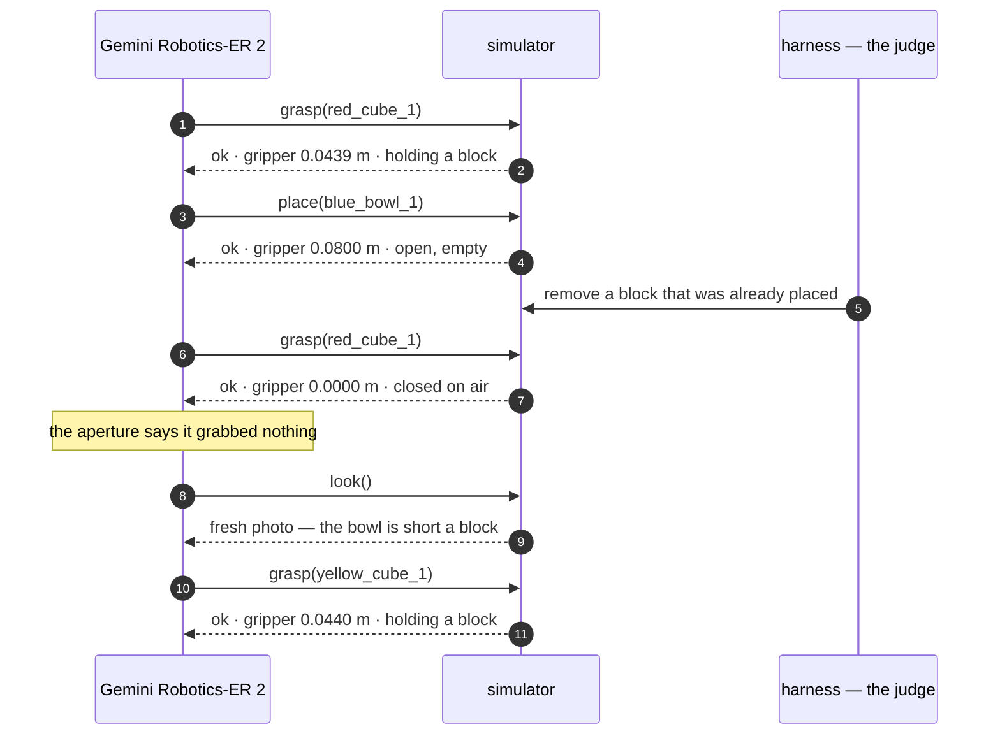
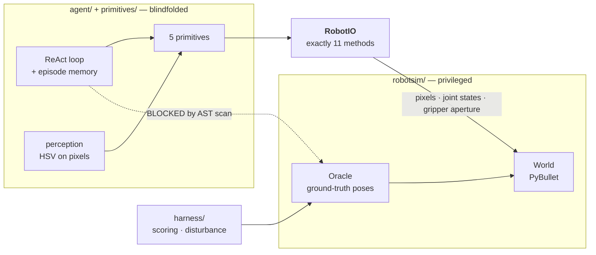

<h1 align="center">Does looking twice make a robot arm better?</h1>

<p align="center">
  <b>A Franka Panda in simulation, driven by Gemini Robotics-ER 2.</b><br>
  Two conditions, identical in every respect but one: whether the robot reads the result of
  its own actions before choosing the next one.
</p>

<p align="center">
  
  
  
  
</p>

---

## Watch it happen

A block that was already placed is removed mid-task. **Left** planned everything up front and
never looks again. **Right** runs a ReAct loop with memory.

<table>
<tr>
<th width="50%">one-shot — claims success, 2 of 3 placed</th>
<th width="50%">agentic — notices, recovers, 3 of 3</th>
</tr>
<tr>
<td></td>
<td></td>
</tr>
</table>

> In each clip the **left panel is the scene** and the **right panel is the overhead frame the
> model actually sees**. Same model, same tools, same prompt.

### What the model said to the simulator



The gripper aperture is the whole tell. **`0.0000` means the fingers closed on empty air** —
free to read, and invisible to a planner that never asks.

---

## The only difference is the loop

```mermaid
flowchart LR
  subgraph OS["one_shot"]
    direction TB
    O1["look()"] --> O2["ONE VLM call<br/>emit the entire plan"]
    O2 --> O3["execute every step<br/>without looking"]
    O3 --> O4["report success"]
  end
  subgraph AG["agentic"]
    direction TB
    A1["look()"] --> A2["VLM call<br/>choose ONE primitive"]
    A2 --> A3["execute it"]
    A3 --> A4["read feedback<br/>error · aperture · fresh photo"]
    A4 --> A5task complete?
    A5 -- no --> A2
    A5 -- yes --> A6["report"]
  end
```

Same model. Same six tools. The same **1,430-byte prompt preamble — literally the same Python
object**, verified byte-identical, first divergence at character 1435. A test fails the build
if they ever drift apart.

---

## Results

Three scenarios, five seeds each, one episode per condition per seed.

<picture>
  <source media="(prefers-color-scheme: dark)" srcset="docs/charts/success_dark.png">
  
</picture>

| scenario | what it demands | one-shot | agentic |
|---|---|:---:|:---:|
| `disturb_h3` | recover after a placed block is removed mid-task | **0%** | **100%** |
| `mem_swap` | two blocks start in each other's bowls; one must be parked first | **20%** | **100%** |
| `match3` | three blocks, three bowls, colour-matched routing | **60%** | **80%** |

### The failure that matters is the silent one

<picture>
  <source media="(prefers-color-scheme: dark)" srcset="docs/charts/false_dark.png">
  
</picture>

A **false success** is an episode where the robot claimed success that the ground-truth oracle
scored as failure. One-shot produced **11 across 15 episodes**; agentic produced **1**.

> A robot that fails and says so is recoverable. One that fails and reports success is not.

### Blind planning decays as the horizon grows

<picture>
  <source media="(prefers-color-scheme: dark)" srcset="docs/charts/horizon_dark.png">
  
</picture>

Same model, same scene family. The only variable is how many steps it commits to before seeing
any result.

---

## The firewall: the agent never sees ground truth

The simulator knows where every object is. The scoring harness may read that. **The agent may
never.** This is enforced structurally, not by convention.



| layer | blocks |
|---|---|
| import scan | `robotsim.oracle`, `robotsim.world`, `harness` |
| attribute scan | `.oracle`, `.world`, `.sim`, `._bowl_centers`, `get_base_*`, `physics_client*` |
| dynamic scan | `__import__`, `eval`, `exec`, `importlib` |
| call-site scan | ground truth injected as a parameter — `def act(self, oracle)` |
| `RobotIO` surface | exactly 11 methods, none returning the pose of anything the robot is not holding |

It was **attacked five times during development and leaked twice** before it held. Both leaks
are written up in [`IMPROVEMENT_CHANGELOG.md`](IMPROVEMENT_CHANGELOG.md). Every scan carries
positive controls, so a detector that stopped detecting fails the build rather than passing
silently.

---

## Grounded in a 2026 result

This replicates the central claim of **[VoLo: A Physical Orchestrator for Open-Vocabulary
Long-Horizon Manipulation](https://arxiv.org/abs/2606.07723)** (NVIDIA, June 2026). VoLo's
baseline family is literally *"single action model (no orchestrator)"* — systems lacking a
monitoring and recovery loop. That is exactly our `one_shot`. VoLo runs on a Franka FR3; we
simulate a Franka Panda. Its Memory / State-Tracking suite includes a **Swap** task,
reproduced here as `mem_swap`.

> [!IMPORTANT]
> **We do not reproduce VoLo.** That needs their benchmark and their hardware. We test the
> same hypothesis in a setting where every variable but one is held fixed.

Secondary: [MEM: Multi-Scale Embodied Memory](https://arxiv.org/abs/2603.03596) (Mar 2026) for
the memory motivation. Origin: [Inner Monologue](https://arxiv.org/abs/2207.05608).

---

## Who this is for

A robotics engineer prototyping a VLM-driven arm. The model is good enough to plan a task from
a photo, so the tempting architecture is one call, full plan, execute. That works until the
world stops matching the plan — and then it fails **silently**: the arm finishes its script and
reports success while the blocks sit on the table. Nothing downstream knows.

The bottleneck is not planning quality. **A plan written at t=0 cannot see t=5.**

---

## Run it

```bash
make setup     # pinned deps — macOS needs a CFLAGS override to build pybullet
make test      # 237 tests
make judge     # replays every episode offline from the committed cache
```

> [!TIP]
> **`make judge` needs no API key and no network.** Every VLM response the eval depends on is
> committed in `cache/`. Live runs cost ~$0.01 per one-shot episode and ~$0.05–0.11 per agentic
> episode. Full details in [`REPRODUCTION.md`](REPRODUCTION.md).

## Repository map

| path | what lives there |
|---|---|
| `robotsim/` | world builder, camera model, `RobotIO` blindfold, ground-truth oracle |
| `primitives/` | the five primitives, HSV perception, feedback objects |
| `agent/` | ReAct loop, episode memory, verification layers, one-shot planner, VLM client + replay cache |
| `harness/` | episode runner, metrics, disturbance hook, report + trajectory generators |
| `scenes.yaml` | all nine scenes as declarative data |
| `docs/evidence/` | curated trajectory pages a judge can read without running anything |
| `cache/` | committed VLM responses — this is what makes `make judge` free |

**Existed before:** [panda-gym](https://github.com/qgallouedec/panda-gym), PyBullet, the Franka
Panda URDF, the Gemini API, OpenCV.
**Built here:** everything in the table above — 237 tests.

---

## The main failure mode

The most instructive bug in this project was **ours**, not the model's.

The agentic condition scored **0/5** on the disturbance scenario and blamed an unreachable
block. The scene checked out — the block was inside the workspace and detected. The trace
showed the agent grasping a second block *while still holding the first*, which dragged the
held one out of reach, so every later attempt returned a genuine `unreachable`.

**Our primitive was corrupting the world, and the result read as an impossible task.** The
agent had been trying to recover the whole time. One guard later: **0% → 100%**.

## Hot take

The interesting number is not success rate — it is the gap between what a robot claims and what
it did.

A blind planner's success rate degrades gracefully as tasks get longer. Its *honesty* does not
degrade at all, because it was never honest: it reports success at a fixed rate regardless of
what happened. Closed-loop execution buys capability, and that is worth measuring. What it
really buys is **a robot whose report you can act on**.

**Judge embodied agents on the honesty gap, not the leaderboard.**
