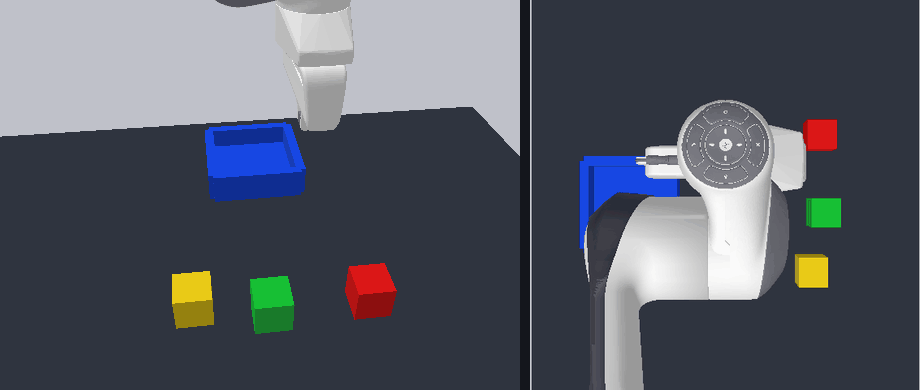
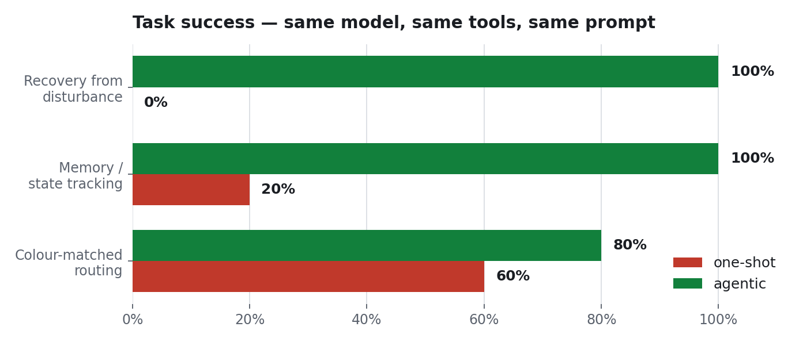
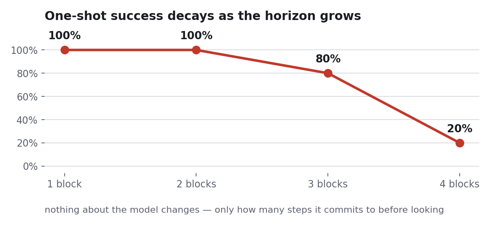
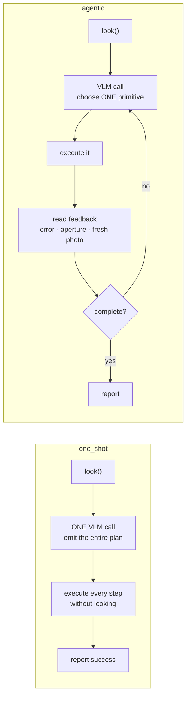
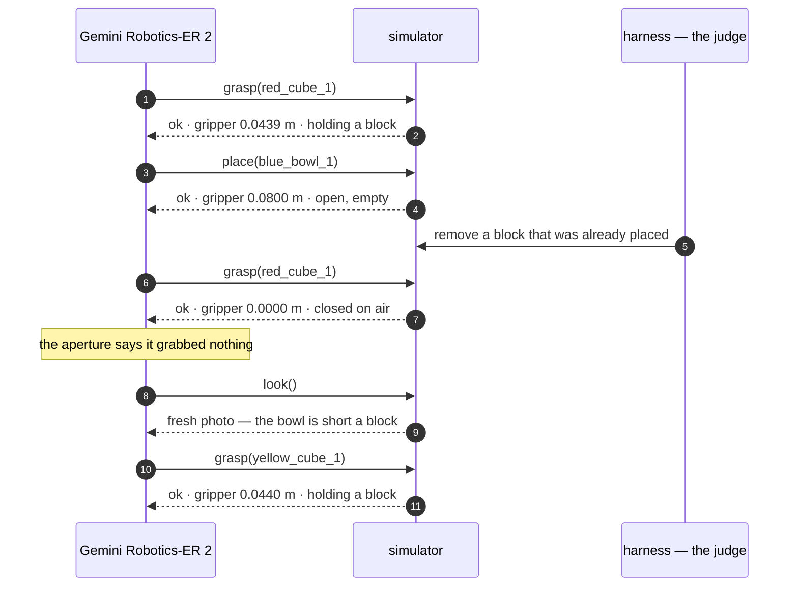
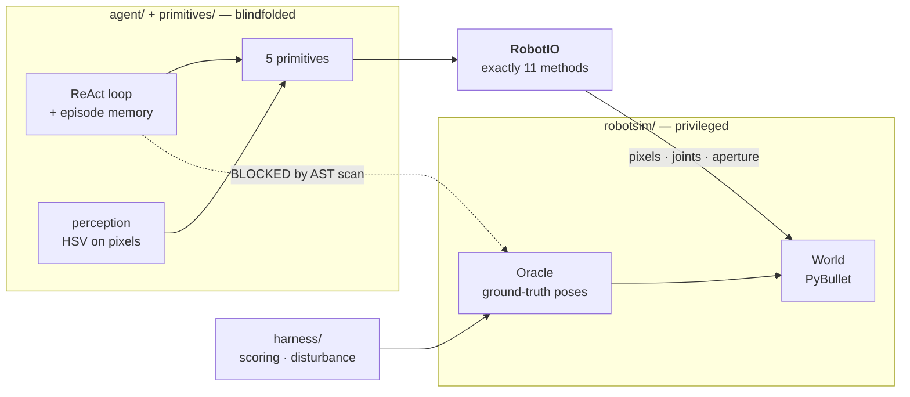

<h1 align="center">Does looking twice make a robot arm better?</h1>

<p align="center">
  A Franka Panda driven by <b>Gemini Robotics-ER 2</b>.<br>
  Two conditions. One difference: whether the robot reads its own feedback.
</p>

<p align="center">
  
  
  
  
</p>

<br>

<table>
<tr>
<th width="50%">one-shot</th>
<th width="50%">agentic</th>
</tr>
<tr>
<td></td>
<td></td>
</tr>
<tr>
<td align="center"><b>claims success · 2 of 3 placed</b></td>
<td align="center"><b>notices · recovers · 3 of 3</b></td>
</tr>
</table>

<p align="center"><i>A placed block is removed mid-task.<br>
Left panel: the scene. Right panel: the overhead frame the model sees.</i></p>

<br>

---

<br>

## Results

<br>

<picture>
  <source media="(prefers-color-scheme: dark)" srcset="docs/charts/success_dark.png">
  
</picture>

<br>

| | one-shot | agentic |
|---|:---:|:---:|
| **Recover** after a placed block is removed | 0% | **100%** |
| **Swap** two blocks that start in each other's bowls | 20% | **100%** |
| **Route** three blocks to colour-matched bowls | 60% | **80%** |

<br>

**False successes — claimed done, oracle disagreed:**  one-shot **11**, agentic **1** (15 episodes each).

<br>

<picture>
  <source media="(prefers-color-scheme: dark)" srcset="docs/charts/horizon_dark.png">
  
</picture>

<br>

---

<br>

## The only difference is the loop

<br>



<br>

Same model. Same six tools. The **same 1,430-byte prompt preamble** — literally the same Python
object, first divergence at character 1435.

<br>

---

<br>

## What the model actually said

<br>



<br>

`0.0000` means the fingers closed on **empty air**.

Free to read. Invisible to a planner that never asks.

<br>

---

<br>

## Run it

```bash
make setup
make test     # 237 tests
make judge    # replays every episode offline — no API key, no network
```

<br>

---

<br>

## The agent never sees ground truth

<br>



<br>

Attacked five times during development. **Leaked twice** before it held.

<details>
<summary><b>How the firewall is enforced</b></summary>

<br>

| layer | blocks |
|---|---|
| import scan | `robotsim.oracle`, `robotsim.world`, `harness` |
| attribute scan | `.oracle`, `.world`, `.sim`, `._bowl_centers`, `get_base_*` |
| dynamic scan | `__import__`, `eval`, `exec`, `importlib` |
| call-site scan | ground truth injected as a parameter — `def act(self, oracle)` |
| `RobotIO` surface | 11 methods, none returning the pose of anything the robot isn't holding |

Every scan carries positive controls, so a detector that stopped detecting fails the build
rather than passing silently. Both leaks are written up in
[`IMPROVEMENT_CHANGELOG.md`](IMPROVEMENT_CHANGELOG.md).

</details>

<br>

---

<br>

## Grounded in a 2026 result

**[VoLo: A Physical Orchestrator for Open-Vocabulary Long-Horizon Manipulation](https://arxiv.org/abs/2606.07723)** — NVIDIA, June 2026.

Its baseline family is literally *"single action model (no orchestrator)"*. That is our `one_shot`.

> [!IMPORTANT]
> **We do not reproduce VoLo.** That needs their benchmark and hardware.
> We test the same hypothesis where every variable but one is held fixed.

<details>
<summary><b>Who this is for, and the other citations</b></summary>

<br>

A robotics engineer prototyping a VLM-driven arm. The model can plan a task from a photo, so
the tempting architecture is one call, full plan, execute.

That works until the world stops matching the plan — and then it fails **silently**.

**The bottleneck is not planning quality. A plan written at t=0 cannot see t=5.**

Secondary: [MEM: Multi-Scale Embodied Memory](https://arxiv.org/abs/2603.03596) (Mar 2026).
Origin: [Inner Monologue](https://arxiv.org/abs/2207.05608).

</details>

<details>
<summary><b>Repository map · what existed before vs what was built here</b></summary>

<br>

| path | what lives there |
|---|---|
| `robotsim/` | world builder, cameras, `RobotIO` blindfold, ground-truth oracle |
| `primitives/` | five primitives, HSV perception, feedback |
| `agent/` | ReAct loop, memory, one-shot planner, VLM client + replay cache |
| `harness/` | episode runner, metrics, disturbance hook, report generators |
| `scenes.yaml` | all nine scenes as declarative data |
| `docs/evidence/` | trajectory pages a judge can read without running anything |
| `cache/` | committed VLM responses — what makes `make judge` free |

**Existed:** panda-gym, PyBullet, the Franka Panda URDF, the Gemini API, OpenCV.
**Built here:** everything in the table above. 237 tests.

</details>

<br>

---

<br>

## The bug that mattered

The agentic condition scored **0/5** on the disturbance scenario and blamed an unreachable block.

The scene checked out. The trace showed the agent grasping a second block *while still holding
the first* — dragging the held one out of reach.

**Our primitive was corrupting the world.** The agent had been trying to recover the whole time.

One guard later: **0% → 100%**.

<br>

---

<br>

## Hot take

The interesting number is not success rate.

It is the gap between **what a robot claims** and **what it did**.

A blind planner's success rate degrades gracefully as tasks get longer. Its honesty does not
degrade at all — because it was never honest. It reports success at a fixed rate regardless of
what happened.

**Judge embodied agents on the honesty gap, not the leaderboard.**

<br>

---

<p align="center"><sub>
MIT licensed · <a href="REPRODUCTION.md">REPRODUCTION.md</a> ·
<a href="IMPROVEMENT_CHANGELOG.md">IMPROVEMENT_CHANGELOG.md</a>
</sub></p>
