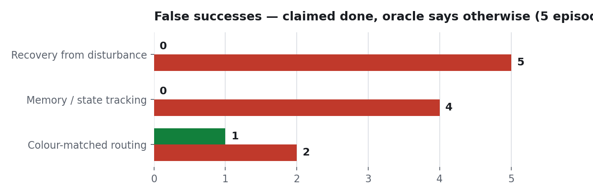

<h1 align="center">Does an agentic loop beat a one-shot plan on a robot arm?</h1>

<p align="center">
  A Franka Panda in simulation, driven by <b>Gemini Robotics-ER 2</b>.<br>
  Two conditions, identical in every respect except one: <b>whether the robot looks at the
  result of its own actions before deciding the next one.</b>
</p>

<p align="center">
  
  
  
  
</p>

---

## The 20-second version

A block that was already placed gets removed mid-task. Left plans everything up front and
never looks again. Right runs a ReAct loop.

| one-shot &mdash; claims success, 2 of 3 placed | agentic &mdash; notices, recovers, 3 of 3 |
|:---:|:---:|
|  |  |

*In each clip: left panel is the scene, right panel is the **overhead frame the model actually
sees**. Same model, same tools, same prompt.*

What the agentic run's own transcript shows at the moment of the disturbance:

```text
place(blue_bowl_1)     ok · gripper 0.0800 m · open, empty
DISTURBANCE            a block that was already placed is removed from the bowl
grasp(red_cube_1)      ok · gripper 0.0000 m · closed on air      <- grabbed nothing
look()                 ok
grasp(yellow_cube_1)   ok · gripper 0.0440 m · holding a block
```

The gripper aperture is the tell. `0.0000` means the fingers closed on empty air &mdash; free to
read, and invisible to a planner that never asks.

---

## Results

Three scenarios, five seeds each, one episode per condition per seed.

<picture>
  <source media="(prefers-color-scheme: dark)" srcset="docs/charts/success_dark.png">
  
</picture>

| scenario | what it demands | one-shot | agentic |
|---|---|---|---|
| `disturb_h3` | recover after a placed block is removed mid-task | **0%** | **100%** |
| `mem_swap` | two blocks start in each other's bowls; one must be parked first | **20%** | **100%** |
| `match3` | three blocks, three bowls, colour-matched routing | **60%** | **80%** |

### The failure that matters is the silent one

<picture>
  <source media="(prefers-color-scheme: dark)" srcset="docs/charts/false_dark.png">
  
</picture>

A **false success** is an episode where the robot claimed success that the ground-truth oracle
scored as failure. One-shot produced **11 of them across 15 episodes**; agentic produced
**1**. A robot that fails and says so is recoverable. One that fails and reports
success is not.

### Success decays as the horizon grows

<picture>
  <source media="(prefers-color-scheme: dark)" srcset="docs/charts/horizon_dark.png">
  
</picture>

Same model, same scene family. The only variable is how many steps it commits to before
seeing any result.

---

## Grounded in a 2026 result

This replicates the central claim of **[VoLo: A Physical Orchestrator for Open-Vocabulary
Long-Horizon Manipulation](https://arxiv.org/abs/2606.07723)** (NVIDIA, June 2026) in a
controlled miniature. VoLo's baseline family is literally *"single action model (no
orchestrator)"* &mdash; systems lacking a monitoring and recovery loop. That is exactly our
`one_shot` condition. VoLo runs on a Franka FR3; we simulate a Franka Panda. Its
Memory/State-Tracking suite includes a **Swap** task, reproduced here as `mem_swap`.

> **We do not reproduce VoLo.** That needs their benchmark and their hardware. We test the
> same hypothesis in a setting where every variable but one is held fixed.

Secondary: [MEM: Multi-Scale Embodied Memory for VLA Models](https://arxiv.org/abs/2603.03596)
(Mar 2026) for the memory motivation. Origin: [Inner Monologue](https://arxiv.org/abs/2207.05608).

---

## Who this is for

A robotics engineer prototyping a VLM-driven arm. The model is good enough to plan a task from
a photo, so the tempting architecture is one call, full plan, execute. That works until the
world stops matching the plan &mdash; and then it fails **silently**: the arm finishes its script
and reports success while the blocks sit on the table.

The bottleneck is not planning quality. **A plan written at t=0 cannot see t=5.**

---

## Fairness by construction

Both conditions share the same model, the same tool schema, the same dispatcher, and the same
**1,430-byte prompt preamble &mdash; the same Python object, verified byte-identical, first
divergence at character 1435**. A test fails the build if they drift apart. The only
difference is the loop.

## The firewall: the agent never sees ground truth

| layer | blocks |
|---|---|
| import scan | `robotsim.oracle`, `robotsim.world`, `harness` |
| attribute scan | `.oracle`, `.world`, `.sim`, `._bowl_centers`, `get_base_*`, `physics_client*` |
| dynamic scan | `__import__`, `eval`, `exec`, `importlib` |
| call-site scan | ground truth injected as a parameter (`def act(self, oracle)`) |
| `RobotIO` surface | exactly 11 methods, none returning the pose of anything the robot is not holding |

Attacked five times during development; **leaked twice** before it held. Both leaks are in
[`IMPROVEMENT_CHANGELOG.md`](IMPROVEMENT_CHANGELOG.md). Every scan carries positive controls,
so a detector that stopped detecting fails the build instead of passing silently.

---

## Run it

```bash
make setup     # pinned deps (macOS needs a CFLAGS override to build pybullet)
make test      # 237 tests
make judge     # replays every episode offline from the committed cache
```

**`make judge` needs no API key.** Live runs cost roughly $0.01 per one-shot episode and
$0.05–0.11 per agentic episode. See [`REPRODUCTION.md`](REPRODUCTION.md).

## What existed before, and what was built here

**Existed:** [panda-gym](https://github.com/qgallouedec/panda-gym), PyBullet, the Franka Panda
URDF, the Gemini API, OpenCV.

**Built here:** the five primitives, the perception stack, the `RobotIO` blindfold, the
ground-truth oracle and its firewall, both agent loops, the disturbance mechanism, nine
scenes, the eval harness, the replay cache, the report and trajectory generators. 237 tests.

---

## The main failure mode, and the hot take

The most instructive bug was ours, not the model's. The agentic condition scored **0/5** on the
disturbance scenario and blamed an unreachable block. The scene checked out. The trace showed
the agent grasping a second block *while still holding the first*, dragging the held one out of
reach &mdash; so every later attempt returned a genuine `unreachable`. **Our primitive was
corrupting the world, and the result read as an impossible task.** The agent had been trying to
recover the whole time. One guard later: **0% to 100%**.

**Hot take.** The interesting number is not success rate, it is the gap between what a robot
claims and what it did. A blind planner's success rate degrades gracefully as tasks get longer
&mdash; but its honesty does not degrade at all, because it was never honest: it reports success
at a fixed rate regardless of what happened. Closed-loop execution buys capability, and that is
worth measuring. What it really buys is a robot whose report you can act on. **Judge embodied
agents on the honesty gap, not the leaderboard.**
